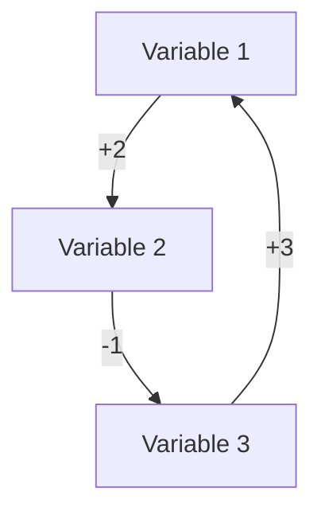

# Relationship Matrix Artifact

## Metadata
- **Task**: 03 - Relationship Matrix Creation
- **Date**: [YYYY-MM-DD]
- **Version**: 1.0
- **Status**: [Draft/Review/Approved]
- **Author**: [Name]
- **Reviewers**: [Names]
- **Input Artifacts**: 
  - 01-variable-identification.md
  - 02-relationship-extraction.md

## Relationship Matrix
### Direct Relationships Matrix

### Matrix Legend
- +3: Strong positive relationship
- +2: Medium positive relationship
- +1: Weak positive relationship
- 0: No direct relationship
- -1: Weak negative relationship
- -2: Medium negative relationship
- -3: Strong negative relationship
- *: Potential indirect relationship

## Subsystem Identification
### Subsystem 1
- Variables: [List]
- Internal Relationships: [List]
- External Connections: [List]

### Subsystem 2
- Variables: [List]
- Internal Relationships: [List]
- External Connections: [List]

## Temporal Matrix
### Short-term Effects
[Matrix showing short-term relationships]

### Long-term Effects
[Matrix showing long-term relationships]

## Stakeholder-Specific Matrices
### Industry Stakeholder Matrix
[Matrix showing industry-specific relationships]

### Government Stakeholder Matrix
[Matrix showing government-specific relationships]

### Research Stakeholder Matrix
[Matrix showing research-specific relationships]

## Matrix Analysis
### Dense Areas
- [List of areas with high relationship density]

### Sparse Areas
- [List of areas with low relationship density]

### Potential Gaps
- [List of potential relationship gaps]

## Confidence Assessment
| Matrix Region | Confidence Score (0-1) | Notes |
|---------------|----------------------|--------|
| [Region] | [Score] | [Notes] |
| ... | ... | ... |

## References
1. [Reference 1]
2. [Reference 2]
...

## Notes for Next Task
- Key considerations for feedback loop identification
- Potential loop patterns to look for
- Areas requiring special attention 