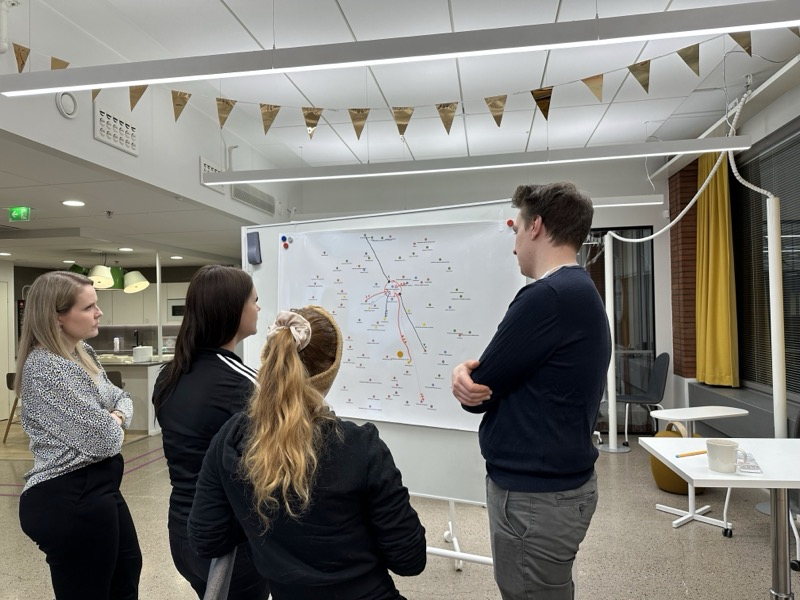
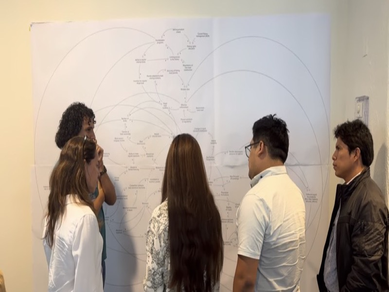
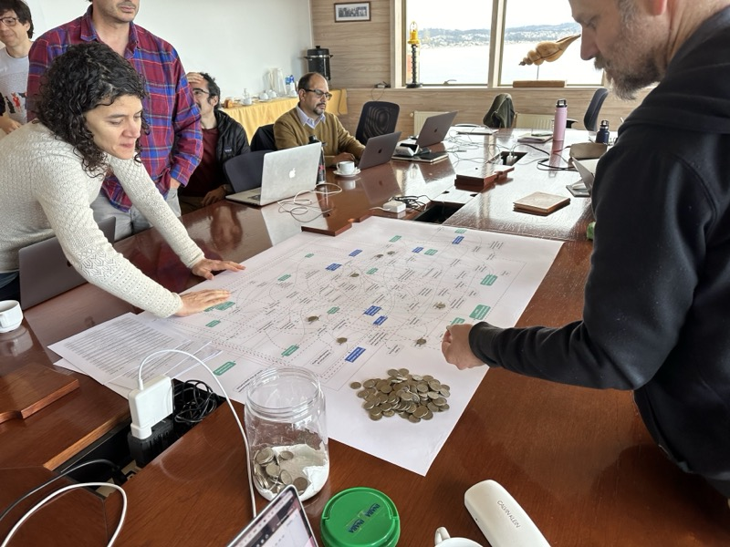
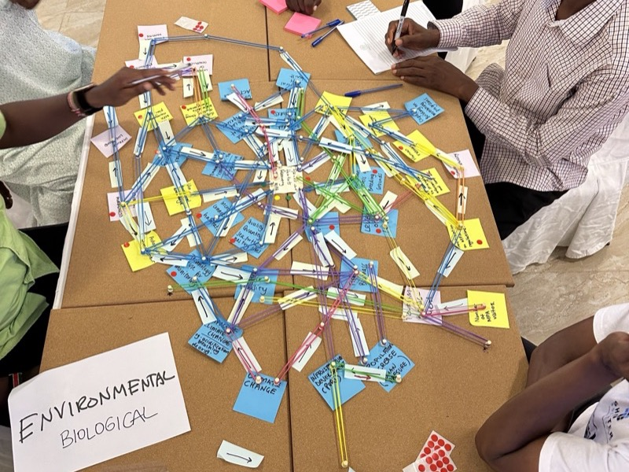

# SIM4Action

**Social-Environmental Interactive Mapping Platform for Action**

[License: AGPL v3](https://www.gnu.org/licenses/agpl-3.0)
[CI](https://github.com/Sim4Action-Labs/sim4action/actions)

An interactive web platform for social-environmental systems mapping and causal analysis. SIM4Action lets you visualise, explore, and simulate complex socio-environmental system dynamics through configurable network graphs—with one shared engine serving multiple system maps from a single deployment.

---

## Statement of Need

Understanding complex socio-environmental systems requires tools that bridge the gap between qualitative systems thinking and quantitative network analysis. Researchers, policymakers, and communities increasingly use causal loop diagrams and systems maps to reason about interconnected ecological, economic, social, and governance dynamics—but existing tools either lack causal simulation (Kumu, PRSM), lack interactive visualisation (FCMpy), or lack network-level analytics such as feedback loop detection and centrality metrics (Mental Modeler).

SIM4Action's contribution is not just a tool but a **conceptual framework for operationalising participatory systems analysis**—the three-stage adaptive management workflow (Understand, Intervene, Monitor), a domain-agnostic engine, and a participatory data architecture—iteratively refined through six years of real-world deployment with fishing communities, NGOs, government regulators, and research organisations across four countries. This framework is implemented through participatory data collection (via Google Sheets), interactive network visualisation (D3.js), two-mode causal diffusion simulation with temporal delays, and structural network analysis (feedback loops, community detection, five centrality metrics) in a single platform. Its target audience is researchers, facilitators, and practitioners working with communities and stakeholders on socio-environmental systems analysis.

---

## Development History

SIM4Action's analytical capabilities were not designed in isolation—they were co-designed with stakeholders across seven internationally funded projects in four countries and the Western Indian Ocean region. Each deployment context contributed specific conceptual innovations to the platform's framework, with workshop participants directly shaping which features were built and how they work. The conceptual framework that the platform embodies—the three-stage adaptive management workflow, the two-mode causal diffusion simulation, the centrality-based monitoring approach—emerged from this sustained participatory engagement rather than from a purely theoretical design process.

The platform originated in 2020 as a Python/Streamlit application ([Sim4Action-Workbench](https://github.com/Sim4Action-Labs/Sim4Action-Workbench)) developed for the ITLA Foundation (Finland). Between 2020 and 2023, it was iteratively extended through participatory modelling workshops across Humboldt Current fisheries in Chile and Peru (Walton Foundation), coastal basin mapping in central Chile (Proyecto Anillo, Pontificia Universidad Católica de Chile), and the Western Indian Ocean (WIOMSA, Minderoo Foundation). In 2025, growing demands for richer interactive visualisation led to a major re-implementation using web technologies (HTML5, JavaScript, D3.js, Pyodide), producing the current platform. Most recently it has been extended for Australian Commonwealth fisheries (CSIRO, Blue Economy CRC, Austral) and applied to water governance in New South Wales and lithium extraction in Chile.

### Case Studies

Each case study below represents a chapter in the evolution of SIM4Action's conceptual framework. The table traces how specific analytical innovations—the participatory workflow, the Intervention Lab, the domain-agnostic engine, the Monitoring Lab, the web re-implementation—arose from concrete stakeholder needs in particular deployment contexts, rather than from a top-down design process:


<table>
  <thead>
    <tr>
      <th width="220">Case Study</th>
      <th width="100">Country</th>
      <th>Scope</th>
      <th width="200">Photo</th>
    </tr>
  </thead>
  <tbody>
    <tr>
      <td><strong>Long-term Social Assistance</strong><br><em>ITLA Foundation, 2020</em></td>
      <td>Finland</td>
      <td>Mapped the systemic drivers of long-term social assistance dependency. First deployment of the original Streamlit prototype; established the core participatory workflow of collaborative factor identification and causal relationship mapping.</td>
      <td></td>
    </tr>
    <tr>
      <td><strong>Humboldt Current Fisheries</strong><br><em>Walton Foundation / ACS, 2021–2024</em></td>
      <td>Chile &amp; Peru</td>
      <td>Participatory systems mapping with octopus and southern hake fishing communities across the Humboldt Current system. Workshops with fishers, NGOs, and regulators drove the development of the token-based causal diffusion simulation (Intervention Lab) in response to stakeholders' need to explore intervention impacts.</td>
      <td></td>
    </tr>
    <tr>
      <td><strong>Coastal Basins</strong><br><em>Proyecto Anillo / PUC / SECOS, 2022–2023</em></td>
      <td>Chile</td>
      <td>Participatory mapping of coastal basin ecosystems in central Chile with researchers and local communities. Reinforced the need for a domain-agnostic engine capable of serving multiple system maps from a single deployment.</td>
      <td></td>
    </tr>
    <tr>
      <td><strong>Western Indian Ocean Fisheries</strong><br><em>WIOMSA / Minderoo Foundation, 2023–2025</em></td>
      <td>WIO Region</td>
      <td>Deployment across multiple Western Indian Ocean nations under the Hifadhi Blu Blue programme, including a 2024 workshop in Zanzibar with Kenya Wildlife Services on the Mombasa Marine Protected Area. Extended the platform's multi-system architecture and introduced the Monitoring Lab (centrality-based indicator selection) to support regional monitoring programme design.</td>
      <td></td>
    </tr>
    <tr>
      <td><strong>Australian Commonwealth Fisheries</strong><br><em>CSIRO / Blue Economy CRC / Austral, 2024–2026</em></td>
      <td>Australia</td>
      <td>Systems mapping for the Southern and Eastern Scalefish and Shark Fishery, Northern Prawn Fishery, and Northwest Shelf Trap Fishery under the Seafood Futures programme. Drove the 2025 web re-implementation (HTML5, D3.js, Pyodide) and community detection features.</td>
      <td><em>Photo pending</em></td>
    </tr>
    <tr>
      <td><strong>Water Resource Compliance</strong><br><em>NRAR / UNSW</em></td>
      <td>Australia</td>
      <td>Systems mapping of non-urban water compliance in New South Wales. Applied the platform to water governance, demonstrating domain-agnostic flexibility beyond fisheries.</td>
      <td><em>Photo pending</em></td>
    </tr>
    <tr>
      <td><strong>Lithium Brine Extraction</strong><br><em>Salar de Atacama</em></td>
      <td>Chile</td>
      <td>Causal mapping of the socio-environmental system around lithium extraction from the Salar de Atacama, one of the world's largest lithium reserves. Extended the platform to extractive industries.</td>
      <td><em>Photo pending</em></td>
    </tr>
  </tbody>
</table>


---

## Quick Start

```bash
# Clone the repository
git clone https://github.com/Sim4Action-Labs/sim4action.git
cd sim4action

# Install Python dependencies
pip install -r requirements.txt

# Start the server (serves the included demo system)
python platform/server.py

# Open http://localhost:8000/
```

The demo system (based on the SESSF fishery) is included in the repository and works out of the box.

Custom port:

```bash
python platform/server.py --port 9000
```

### Requirements

- Python 3.8+
- Modern browser (Chrome, Firefox, Safari, Edge)
- Internet connection (Google Sheets API, CDN assets)

---

## Features

### Interactive Systems Mapping

- **Force-directed network graph** powered by D3.js with drag, zoom, and pan
- **Google Sheets data source** — define factors and relationships in a spreadsheet, see them rendered as an interactive network

### Three Analysis Labs

- **Diagnostics Lab** — Filter by domain, relationship type, strength, and temporal scale
- **Intervention Lab** — Token diffusion simulation (probabilistic and deterministic) for causal analysis, with forward and backward propagation
- **Monitoring Lab** — Centrality analysis (degree, betweenness, closeness, eigenvector, Katz) to identify leverage points

### Network Analysis

- **Feedback loops** — Detect and visualise reinforcing and balancing feedback loops
- **Community detection** — Louvain and Girvan–Newman algorithms
- **Drawing layer** — Annotate maps with shapes and text

### Multi-System Architecture

- **Single engine** — One codebase (`platform/`) serves all system maps
- **Config-driven** — Each system is defined by `systems/{id}/config.json`; loaded via `app.html?system={id}`
- **Catalogue browser** — Landing page with filterable catalogue of all registered systems

---

## Design Philosophy

SIM4Action's architecture reflects three design tensions encountered over six years of participatory research deployment:

1. **Analytical rigour vs. accessibility** — Core analytical libraries (`browser_analysis.py`, `feedback_loops.py`, `diffusion.js`) are standalone modules with zero browser dependencies, importable in any Python or Node.js environment for scripted research pipelines. For non-technical stakeholders, these same libraries power an interactive web interface that requires no installation beyond a browser.

2. **Deployment simplicity vs. analytical power** — Running Python's scientific stack (NetworkX, pandas) in the browser via Pyodide eliminates server-side compute infrastructure. A single static file server—or even `python -m http.server`—is sufficient, making the platform deployable in low-resource institutional contexts while retaining full graph-theoretic analysis capabilities.

3. **Single-use tool vs. reusable framework** — Rather than building a separate application for each socio-environmental system, a configuration-driven engine serves all system maps from one codebase. Each system is defined by a JSON config and a Google Sheets data source, so new maps can be created by non-developers through the web interface.

**Conceptual design decisions from participatory fieldwork:** The three-stage workflow (Understand, Intervene, Monitor) crystallised from observing that workshop participants naturally follow this cognitive sequence. Two diffusion modes serve two stakeholder needs: probabilistic for uncertainty-aware communities (e.g., fishers), deterministic for reproducible policy briefs. Forward and backward propagation answer the practitioner's question ("what happens if we act here?") and the policymaker's question ("what drives this outcome?"). Google Sheets as a data source gives stakeholders ownership of their data in a familiar interface. No build step (no npm, webpack, or bundlers) lowers the barrier for researcher-developers.

For full design rationale and trade-off analysis, see the [JOSS paper](paper/paper.md#software-design).

---

## Platform Guide & Systems Thinking Primer

The landing page includes a comprehensive built-in guide accessible by expanding the **Platform Guide & Systems Thinking Primer** panel. It walks users through the full analytical workflow with illustrative examples, interactive diagrams, and worked scenarios:


| Tab                           | Content                                                                                                                                                                                                                                                                                                                                    |
| ----------------------------- | ------------------------------------------------------------------------------------------------------------------------------------------------------------------------------------------------------------------------------------------------------------------------------------------------------------------------------------------ |
| **Why Systems Thinking?**     | Concepts (interconnectedness, feedback loops, time delays, emergence); what a causal system map is; an illustrated causal complexity example; participatory systems mapping; the three-step SIM4Action workflow                                                                                                                            |
| **1 — Understand the System** | Diagnostics Lab walkthrough: network visualisation (node/edge encoding), relationship properties (polarity, strength, delay), feedback loop detection (reinforcing vs. balancing), and cluster/community detection                                                                                                                         |
| **2 — Design Interventions**  | Intervention Lab walkthrough: the token diffusion metaphor, how propagation works (probabilistic and deterministic modes), scenario vs. ensemble mode, interpreting results (time-series, AUC, controllability), probabilistic vs. deterministic comparison, backward diffusion & root-cause analysis, and the genetic algorithm optimiser |
| **3 — Monitor & Evaluate**    | Monitoring Lab walkthrough: why centrality matters, five centrality metrics explained (degree, betweenness, closeness, eigenvector, Katz), and how to identify leverage points and sentinel indicators                                                                                                                                     |
| **From Knowledge to Action**  | Bridging analysis and policy: the implementation gap, how SIM4Action operationalises adaptive management, concrete decision pathways, evidence-based principles, and what makes SIM4Action different                                                                                                                                       |
| **Building the Map**          | The spectrum of map-building approaches (expert-driven, participatory, agentic AI extraction), overview of the agentic extraction workflow, and the five-phase pipeline                                                                                                                                                                    |
| **References**                | Peer-reviewed sources cited throughout the primer                                                                                                                                                                                                                                                                                          |


---

## Core Libraries

SIM4Action's analytical capabilities are implemented as standalone libraries with zero browser dependencies. They can be used outside the web interface in any Python or Node.js environment.

### Python (`platform/`)


| Library               | Purpose                                                           |
| --------------------- | ----------------------------------------------------------------- |
| `browser_analysis.py` | Network centrality, community detection, graph metrics (NetworkX) |
| `feedback_loops.py`   | Cycle enumeration, polarity classification, deduplication         |
| `networkx_loader.py`  | `build_graph_from_data()` — graph construction from tabular data  |


### JavaScript (`platform/`)


| Library        | Purpose                                                     |
| -------------- | ----------------------------------------------------------- |
| `diffusion.js` | Probabilistic and deterministic causal diffusion simulation |


### Standalone Usage

```bash
# Python: network analysis + feedback loops
python examples/analyze_network.py

# Node.js: diffusion simulation
node examples/run_diffusion.mjs
```

See `examples/` for complete working scripts.

---

## Using with Your Own Systems

### Via the Web UI

1. Open the landing page and click **Add New System Map**
2. Enter name, category, description, and Google Sheets URL
3. Click **Validate Google Sheet Structure**, then **Create System Map**

### Manually

Create `systems/my_system/config.json`:

```json
{
  "id": "my_system",
  "name": "My System",
  "title": "My System - SIM4Action",
  "description": "A brief description.",
  "spreadsheets": { "main": "GOOGLE_SHEET_ID" },
  "apiKey": "YOUR_GOOGLE_SHEETS_API_KEY",
  "images": {
    "systemImage": { "src": "system-image.png", "alt": "My System" }
  }
}
```

Add the system to `systems/catalogue.json` and restart the server.

### External Systems Directory

Keep your system maps in a separate directory (useful for private data):

```bash
python platform/server.py --systems-dir /path/to/my/systems --users-file /path/to/users.json
```

---

## Google Sheets Structure

Each system map is driven by a Google Sheet with two tabs. Share it with **"Anyone with the link" → Viewer**.

**FACTORS** (columns A–E): `factor_id`, `name`, `domain_name`, `intervenable`, `definition`

**RELATIONSHIPS** (columns A–I): `relationship_id`, `from`, `to`, `from_factor_id`, `to_factor_id`, `polarity`, `strength`, `delay`, `definition`

---

## Project Structure

```
sim4action/
├── platform/                # Shared engine
│   ├── index.html          # Landing page (catalogue browser)
│   ├── app.html            # Main app (config-driven per system)
│   ├── server.py           # Python HTTP server + REST API
│   ├── diffusion.js        # Token diffusion (JS, standalone)
│   ├── browser_analysis.py # Network analysis (Python, standalone)
│   ├── feedback_loops.py   # Feedback loops (Python, standalone)
│   └── networkx_loader.py  # Graph construction (Python, standalone)
├── systems/
│   ├── catalogue.json      # System registry
│   └── demo_fishery/       # Included demo system
├── examples/               # Standalone usage examples
├── tests/                  # Automated test suite
├── paper/                  # JOSS paper
├── LICENSE                 # AGPL-3.0
├── CITATION.cff
├── CONTRIBUTING.md
└── requirements.txt
```

---

## Technology Stack


| Layer            | Technology                                            |
| ---------------- | ----------------------------------------------------- |
| Frontend         | HTML5, CSS3, JavaScript (ES6+) — no build step        |
| Visualisation    | D3.js v7                                              |
| Charts           | Chart.js                                              |
| Graph (client)   | Graphology                                            |
| Graph (analysis) | NetworkX via Pyodide (in-browser Python)              |
| Data source      | Google Sheets API v4                                  |
| Server           | Python 3 `http.server`                                |
| Diffusion        | Custom `diffusion.js` (probabilistic + deterministic) |


---

## Testing

```bash
# Python tests
pytest tests/ -v

# Node.js diffusion tests
node tests/test_diffusion_node.mjs

# Lint
ruff check platform/*.py tests/*.py
```

---

## Citation

If you use SIM4Action in your research, please cite:

```bibtex
@software{castilla_rho_sim4action,
  author    = {Castilla-Rho, Juan},
  title     = {SIM4Action: Social-Environmental Interactive Mapping Platform for Action},
  year      = {2026},
  url       = {https://github.com/Sim4Action-Labs/sim4action}
}
```

See `CITATION.cff` for the full citation metadata.

---

## Contributing and Support

Contributions are welcome! See [CONTRIBUTING.md](CONTRIBUTING.md) for guidelines on:

- **Contributing** code, documentation, or system maps
- **Reporting bugs** via the [issue tracker](https://github.com/Sim4Action-Labs/sim4action/issues) (bug report template provided)
- **Requesting features** via the [issue tracker](https://github.com/Sim4Action-Labs/sim4action/issues) (feature request template provided)
- **Seeking support** via [GitHub Discussions](https://github.com/Sim4Action-Labs/sim4action/discussions) or by opening an issue

---

## License

SIM4Action is licensed under the [GNU Affero General Public License v3.0](LICENSE) (AGPL-3.0).

---

## Acknowledgements

Development of SIM4Action has been supported by the ITLA Foundation (Finland); the Walton Foundation through Advanced Conservation Strategies; the Minderoo Foundation and WIOMSA under the HIF-ID Blue programme; CSIRO, the Blue Economy CRC, and Austral under the Seafood Futures programme; the Natural Resources Access Regulator and UNSW; and Proyecto Anillo through Pontificia Universidad Católica de Chile. The author thanks Josh Donlan, Stefan Gelcich, Rodrigo Estévez, and Raúl Arteaga (Advanced Conservation Strategies) for supporting the Humboldt Current fisheries mapping; Sebastián Vicuña and Inti Lefort (Pontificia Universidad Católica de Chile) for collaboration on the coastal basins project.